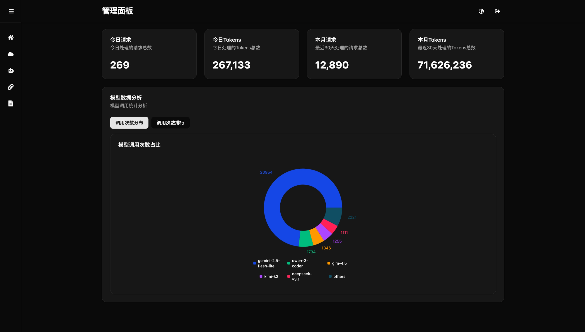

# LLMIO

LLMIO 是一个基于 Golang 的项目，提供统一的 API 来与各种大语言模型（LLM）进行交互。它支持在不同提供商之间进行智能负载均衡，并高效地处理请求。该服务还提供了一个现代化的 Web UI 界面，方便用户管理和监控系统。

## 功能特性

- **统一 API 访问**：通过单一 API 接入多种 LLM 提供商（如 OpenAI、Anthropic）
- **智能负载均衡**：支持带权重的随机选择和基于工具调用/结构化输出/多模态/权重/限流的智能路由
- **流式和非流式响应**：同时支持流式和标准响应模式
- **速率限制处理**：自动处理提供商的速率限制
- **使用情况跟踪**：详细的日志记录和使用情况统计
- **Web 管理界面**：直观的 Web UI 用于管理提供商、模型和监控系统
- **系统监控**：实时查看请求统计、模型使用情况和请求日志
- **提供商连通性测试**：内置测试功能验证提供商连接

## 主页


## 多对一模型映射关联


## 部署

### Docker

使用提供的 Dockerfile 构建镜像：

```bash
docker build -t llmio .
docker run -p 7070:7070 -e TOKEN=your-token llmio
```

### Docker Compose

```yml
services:
  llmio:
    image: atopos31/llmio:latest
    ports:
      - 7070:7070
    volumes:
      - ./db:/app/db
    environment:
      - GIN_MODE=release
      - TOKEN=<YOUR_TOKEN>
      - TZ=Asia/Shanghai
```

```bash
docker compose up -d
```

## 开发

### 快速开始（推荐）

使用一键启动脚本快速启动开发环境：

```bash
# 自动创建数据库目录、安装前端依赖并启动服务
chmod +x start.sh
./start.sh
```

脚本默认设置 `TOKEN=12345`，自动检测并使用 pnpm 或 npm 管理前端依赖，兼容 Linux 和 macOS 系统。

### 手动安装

### 先决条件

- Go 1.25.0+
- Node.js 20+
- pnpm (推荐) 或 npm

### 安装

1. 克隆仓库：
   ```bash
   git clone https://github.com/atopos31/llmio.git
   cd llmio
   ```

2. 安装后端依赖：
   ```bash
   go mod tidy
   ```

3. 初始化数据库：
   ```bash
   mkdir db
   export TOKEN=12345  # API 访问令牌,用于管理界面和 API 认证
   go run main.go
   ```
   这将自动创建 SQLite 数据库文件（`db/llmio.db`）并初始化数据库结构。

4. 构建前端界面：
   ```bash
   cd webui
   pnpm install  # 或使用 npm install
   pnpm build    # 或使用 npm run build
   cd ..
   ```

   前端使用 React 19 + TypeScript + Vite + Tailwind CSS 构建，支持现代化的响应式设计。

5. 前端开发模式（可选）：
   ```bash
   cd webui
   pnpm dev  # 或使用 npm run dev
   ```
   开发服务器将在 `http://localhost:5173` 启动，支持热更新。

### 配置

该服务使用数据库来存储提供商和模型的配置。你可以通过 Web UI 或直接操作数据库来添加提供商和模型。

#### 环境变量

- `TOKEN`: API 访问令牌，用于管理界面和 API 认证（推荐设置，默认 `12345`）
- `GIN_MODE`: Gin 运行模式，可选值 `debug`、`release`（生产环境推荐 `release`）
- `TZ`: 时区设置（可选，默认 `UTC`，推荐 `Asia/Shanghai`）

#### 提供商配置示例

通过 Web UI 添加提供商时，系统会自动处理 Base URL，无需手动添加 `/v1` 后缀。

**OpenAI 兼容提供商：**
- 名称: openai
- 类型: openai
- Base URL: `https://api.openai.com`（系统会自动添加 `/v1`）
- API Key: `your-api-key`
- 控制台地址（可选）: `https://platform.openai.com`

**Anthropic 兼容提供商：**
- 名称: anthropic
- 类型: anthropic
- Base URL: `https://api.anthropic.com`（系统会自动添加 `/v1`）
- API Key: `your-api-key`
- Version: `2023-06-01`
- 控制台地址（可选）: `https://console.anthropic.com`

#### 模型配置示例

- 名称: gpt-3.5-turbo
- 描述: OpenAI 的 GPT-3.5 Turbo 模型
- 名称: claude-3-haiku-20240307
- 描述: Anthropic 的 Claude 3 Haiku 模型

### 运行服务

启动服务：
```bash
go run main.go
```

服务将在 `http://localhost:7070` 可用。
- API 端点: `http://localhost:7070/v1/`
- 管理界面: `http://localhost:7070/`

## Web 管理界面

LLMIO 提供了一个现代化的 Web 管理界面，包含以下功能：

1. **系统概览**：实时显示系统指标，如请求次数、Token 使用情况和模型调用统计
2. **提供商管理**：添加、编辑、删除和测试 LLM 提供商连接
3. **模型管理**：管理可用的模型及其配置
4. **模型映射**：关联模型与提供商，配置权重和负载均衡策略
5. **请求日志**：查看详细请求日志，支持筛选和分页

访问 `http://localhost:7070/` 来使用 Web 管理界面。

## API 端点

### 聊天补全

POST `/v1/chat/completions`

请求体遵循 OpenAI 聊天补全 API 格式。

示例：
```json
{
  "model": "gpt-3.5-turbo",
  "messages": [
    {
      "role": "user",
      "content": "Hello!"
    }
  ],
  "stream": true
}
```

### Anthropic Messages

POST `/v1/messages`

请求体遵循 Anthropic Messages API 格式，用于与 Claude 模型交互。

示例：
```json
{
  "model": "claude-3-haiku-20240307",
  "max_tokens": 1024,
  "messages": [
    {
      "role": "user",
      "content": "Hello!"
    }
  ]
}
```

### 模型列表

GET `/v1/models`

返回可用模型的列表。

### 管理 API

所有以下端点都需要在请求头中包含 `Authorization: Bearer YOUR_TOKEN`：

- GET `/api/providers` - 获取所有提供商
- POST `/api/providers` - 创建提供商
- PUT `/api/providers/:id` - 更新提供商
- DELETE `/api/providers/:id` - 删除提供商

- GET `/api/models` - 获取所有模型
- POST `/api/models` - 创建模型
- PUT `/api/models/:id` - 更新模型
- DELETE `/api/models/:id` - 删除模型

- GET `/api/model-providers` - 获取模型映射关联
- POST `/api/model-providers` - 创建模型映射关联
- PUT `/api/model-providers/:id` - 更新模型映射关联
- DELETE `/api/model-providers/:id` - 删除模型映射关联

- GET `/api/logs` - 获取请求日志
- GET `/api/metrics/use/:days` - 获取使用指标
- GET `/api/metrics/counts` - 获取模型计数统计

## 架构

该服务由以下组件构成：

- **main.go**: 应用程序入口点
- **handler/**: API 端点的 HTTP 处理器
- **service/**: 聊天补全和负载均衡的业务逻辑
- **providers/**: 不同 LLM 提供商的实现（OpenAI、Anthropic）
- **models/**: 数据库模型和初始化
- **balancer/**: 负载均衡算法
- **common/**: 通用工具和响应助手
- **webui/**: 前端管理界面（React 19 + TypeScript + Vite + Tailwind CSS）
- **middleware/**: 中间件（身份验证、请求日志等）

## 贡献

欢迎贡献！请提交 issue 或 pull request。

## 许可证

该项目基于 MIT 许可证。